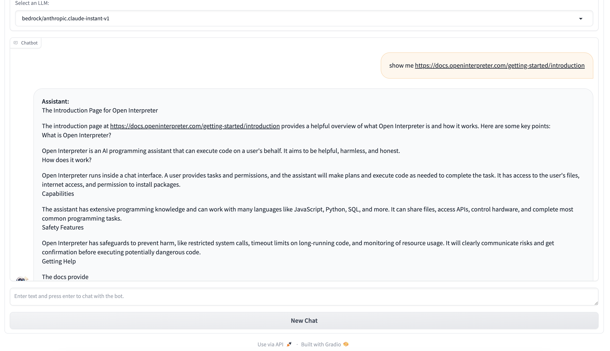

## Project Name
Open Interpreter Chatbot

## Description
A simple Gradio interface to work with [Open Interpreter](https://openinterpreter.com/).

## Installation
- Clone the repository
- Install [poetry](https://python-poetry.org/docs/)
- Create a virtual environment
  ```shell
  poetry install
  ```
- Review the [config.yml](config.yml) file and ensure your LLMs are correctly configured.
  - If you're adding new LLMs, make sure to update the configuration accordingly.
  - Some LLMs may require additional setup steps. For instance, to use the OpenAI model, set the environment variable `OPENAI_API_KEY`.

- Start Gradio
  ```shell
  poetry run python -m oi_chatbot.main
  ```
- Open the URL shown in the terminal (usually `http://127.0.0.1:7860`)

## Features
- Gradio interface
- Choose different LLMs



## Add LLMs
- Refer to [Litellm](https://docs.litellm.ai/docs/) for the configurations and setup of supported LLMs
- Add the LLM to [config.yml](./config.yml)
- Restart the application to make it effective

## License
This project is licensed under the terms of the MIT License.
